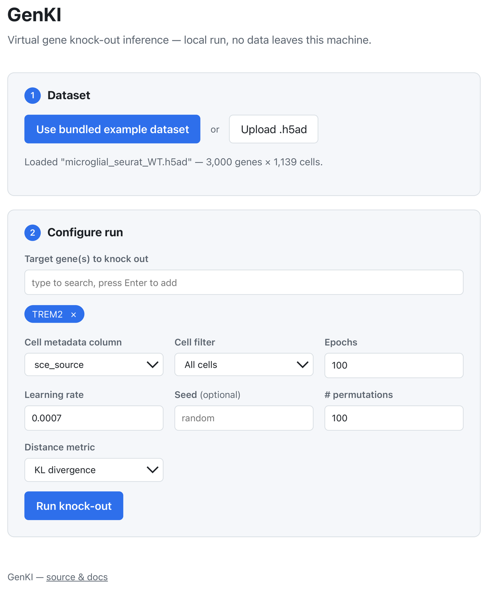

# GenKI — Gene Knock-out Inference

[](https://pypi.org/project/GenKI/)
[](LICENSE)
[](https://doi.org/10.1093/nar/gkad450)

A Variational Graph Auto-Encoder (VGAE) model for predicting gene perturbation effects from scRNA-seq data. GenKI performs *in silico* gene knock-out experiments on a gene regulatory network (GRN) without requiring real knock-out data.

<p align="center">
    
</p>

> 🆕 **New: a local web UI.** Run GenKI from your browser — no code required.
> Requires **Python ≥ 3.10**.
> ```shell
> pip install --no-cache-dir "GenKI[web]"
> genki-ui
> ```
> Upload a `.h5ad`, pick a gene to knock out, and get ranked results in a few
> clicks. See [Web UI](#web-ui) below.

<p align="center">
    
</p>

## Prerequisites

GenKI requires **Python ≥ 3.10**. **PyTorch** and **PyTorch Geometric** are installed automatically (CPU builds) with the package. For a GPU/CUDA build, install them first to match your CUDA version:

1. [Install PyTorch](https://pytorch.org/get-started/locally/)
2. [Install PyTorch Geometric](https://pytorch-geometric.readthedocs.io/en/latest/notes/installation.html)

## Installation

```shell
pip install GenKI
```

Or with conda (sets up the full environment):

```shell
conda env create -f environment.yml
conda activate ogenki
```

## Example Data

A real microglial (wild-type) scRNA-seq dataset is bundled in [`data/microglial_seurat_WT.h5ad`](data/microglial_seurat_WT.h5ad) so you can run GenKI immediately without sourcing your own data. The Quick Start examples below use it directly.

## Quick Start

The high-level `GenKI` facade runs the whole workflow — load & preprocess data, build the GRN, train the VGAE, and rank genes — in one call:

```python
from GenKI import GenKI

# Uses the bundled example dataset — no extra downloads needed
ranked = GenKI.from_h5ad(
    "data/microglial_seurat_WT.h5ad",
    target_gene=["TUBG1"],   # gene(s) to knock out (upper-cased by default)
).run(epochs=100, seed=8096, n_permutations=100)

print(ranked)   # genes ranked by perturbation effect
```

Separate the training and prediction steps when you want to inspect the model in between:

```python
gk = GenKI.from_h5ad("data/microglial_seurat_WT.h5ad", target_gene=["TUBG1"])
gk.fit(epochs=100, lr=7e-4, beta=1e-4, seed=8096)
ranked = gk.predict(n_permutations=100, by="KL")

print(gk.metrics)        # (epochs, loss, AUROC, AP)
gk.loader, gk.trainer    # escape hatch to the underlying objects
```

Start from an in-memory `AnnData` instead of a file (set `preprocess=True` to normalize/standardize it):

```python
import scanpy as sc

adata = sc.read_h5ad("data/microglial_seurat_WT.h5ad")
gk = GenKI.from_adata(adata, target_gene=["TUBG1"], preprocess=True)
ranked = gk.run(seed=8096)
```

Building the GRN in parallel needs the optional Ray extra (`pip install "GenKI[ray]"`); pass `n_cpus` and other GRN options as keyword arguments, e.g. `GenKI.from_h5ad(..., rebuild_grn=True, n_cpus=8)`.

## Web UI

Prefer clicking over scripting? Install the `web` extra and launch a local
UI — upload a `.h5ad`, pick a target gene, and run the workflow from the
browser, no code required. Requires **Python ≥ 3.10**; on an older
interpreter pip silently installs an ancient release without the `web`
extra:

```shell
pip install --no-cache-dir "GenKI[web]"
genki-ui
# opens http://127.0.0.1:8931 (pass --port to use a different one)
```

From a git checkout you can also skip the upload step and use the bundled
example dataset directly in the UI (the 124 MB `data/` file isn't shipped in
the PyPI package, so that shortcut only works from source). Everything runs
locally; no data leaves your machine.

Pick one or more genes to knock out, tune epochs/learning rate/permutations
if you like, and hit **Run**. The UI shows the top 15 ranked genes at a
glance; download the CSV for the full ranked list.

## GRN build time

`make_pcNet` fits a leave-one-out principal-component regression for every gene, so cost grows roughly as **O(genes² × cells × nComp)**. The table below is wall-clock seconds on an Apple M1 Pro (8 cores, 16 GB RAM) under the default settings (`nComp=3`, `svd_solver="auto"`, `n_cpus=8`) on a low-rank synthetic matrix; real scRNA-seq scales similarly at the same shape.

| cells \ genes | 1 000 | 3 000 | 5 000 |
|---:|---:|---:|---:|
| **500**  | 11 s | 29 s | 77 s |
| **1 000** | 12 s | 52 s | 2 min 13 s |
| **2 000** | 18 s | 1 min 37 s | 4 min 22 s |

For reference, the bundled `notebook/Example.ipynb` (1 139 cells × 3 000 genes, `n_cpus=8`) builds the GRN in about **1 minute** on this hardware.

Notes:
- Cost scales roughly linearly in `cells` and quadratically in `genes` once you're past the per-call Ray overhead (~10 s for `n_cpus=8`).
- `n_cpus > 1` requires the optional Ray extra (`pip install "GenKI[ray]"`); the speedup from sharding is modest because numpy's BLAS already multithreads the per-gene SVDs.
- GRNs are cached as `.npz` under `GRN_file_dir` (default `GRNs/`) — you pay this cost once per (cells, genes, nComp) selection. Pass `rebuild_grn=True` only when one of those changes.

<details>
<summary><b>Lower-level API</b> (fine-grained control over each step)</summary>

```python
from GenKI.preprocessing import build_adata
from GenKI.dataLoader import DataLoader
from GenKI.train import VGAE_trainer
from GenKI import utils

# 1. Load and preprocess data
adata = build_adata("data/microglial_seurat_WT.h5ad")

# 2. Build GRN and prepare WT / virtual-KO graph data
data_wrapper = DataLoader(
    adata,
    target_gene=["TUBG1"],   # gene to knock out
    target_cell=None,         # None = use all cells
    GRN_file_dir="GRNs",
    n_cpus=8,
)
data_wt = data_wrapper.load_data()
data_ko = data_wrapper.load_kodata()

# 3. Train VGAE
sensei = VGAE_trainer(data_wt, epochs=100, lr=7e-4, beta=1e-4, seed=8096)
sensei.train()

# 4. Get latent distributions and compute KL divergence per gene
z_mu_wt, z_std_wt = sensei.get_latent_vars(data_wt)
z_mu_ko, z_std_ko = sensei.get_latent_vars(data_ko)
dis = utils.get_distance(z_mu_ko, z_std_ko, z_mu_wt, z_std_wt, by="KL")

# 5. Rank genes by perturbation effect (with permutation test)
null = sensei.pmt(data_ko, n=100, by="KL")
res = utils.get_generank(data_wt, dis, null)
print(res)
```

</details>

## API

| Symbol | Description |
|---|---|
| `GenKI.GenKI` | High-level facade: `from_h5ad` / `from_adata` constructors and `fit` / `predict` / `run` methods covering the full workflow |
| `GenKI.dataLoader.DataLoader` | Wraps an `AnnData` object, builds/loads the GRN, and produces PyG `Data` objects for WT and virtual-KO conditions |
| `GenKI.train.VGAE_trainer` | Trains the VGAE, exposes latent variables, permutation testing, and model save/load |
| `GenKI.utils.get_distance` | Computes per-gene distribution distance (KL, EMD, t-test) between two latent spaces |
| `GenKI.utils.get_generank` | Ranks genes by perturbation score; optionally filters by permutation-test significance |
| `GenKI.preprocessing.build_adata` | Loads an `.h5ad` file and adds a log-normalised layer used by `DataLoader` |
| `GenKI.pcNet.make_pcNet` | Builds a principal-component-based GRN from expression data (optionally parallelised with Ray) |

## Tutorial

Step-by-step virtual KO example:
[notebook/Example.ipynb](https://github.com/yjgeno/GenKI/blob/master/notebook/Example.ipynb)

## Citation

If you use GenKI in your research, please cite:

> Yang Y, Wang M, Ni P, Zhong J. *GenKI: Virtual gene knockout inference with variational graph autoencoder*. Nucleic Acids Research, 2023. https://doi.org/10.1093/nar/gkad450
